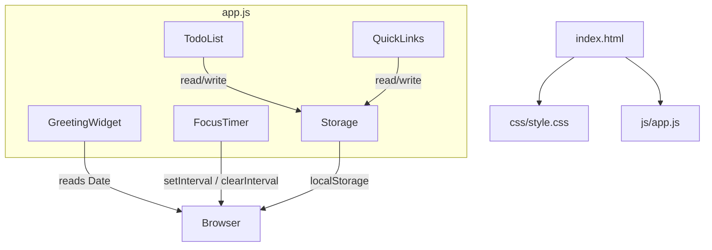

# Design Document: To-Do Life Dashboard

## Overview

The To-Do Life Dashboard is a single-page, client-side web application built with plain HTML, CSS, and Vanilla JavaScript. It runs by opening `index.html` directly in a browser — no server, no build step, no dependencies.

The application is composed of four widgets rendered in a single viewport:

- **Greeting Widget** — real-time clock, date, and time-of-day greeting
- **Focus Timer** — 25-minute Pomodoro countdown with start/stop/reset
- **To-Do List** — persistent task management with add, edit, complete, and delete
- **Quick Links** — persistent shortcut buttons to user-defined URLs

All state is stored in `localStorage` as JSON-serialised arrays. The entire application lives in three files:

```
index.html
css/style.css
js/app.js
```

---

## Architecture

The application follows a simple **module pattern** inside a single `app.js` file. There is no framework, no virtual DOM, and no module bundler. Each widget is an isolated object with its own `init()`, state, and DOM-manipulation methods. A shared `Storage` utility handles all `localStorage` reads and writes.



**Execution flow:**

1. `DOMContentLoaded` fires.
2. Each widget's `init()` is called in order.
3. `GreetingWidget` starts a 1-second interval to update the clock.
4. `FocusTimer` renders its initial state (25:00, Start enabled).
5. `TodoList` loads tasks from `localStorage` and renders them.
6. `QuickLinks` loads links from `localStorage` and renders them.

All DOM updates are direct `innerHTML` / `textContent` assignments or `classList` toggles — no diffing library needed given the small data sets involved.

---

## Components and Interfaces

### Storage Utility

Responsible for all `localStorage` interaction. Centralising this makes it easy to swap the storage backend in the future and ensures consistent error handling.

```js
Storage = {
  get(key)        // → Array (empty array on missing key or parse error)
  set(key, array) // → void (serialises to JSON and writes)
}
```

Keys used:
- `"tld_tasks"` — Task array
- `"tld_links"` — Link array

### GreetingWidget

Owns the `#greeting` section of the DOM.

```js
GreetingWidget = {
  init()          // binds DOM refs, starts 1s interval
  _tick()         // called every second; updates time, date, greeting text
  _getGreeting(hour) // → string ("Good morning" | "Good afternoon" | "Good evening" | "Good night")
}
```

### FocusTimer

Owns the `#timer` section of the DOM.

```js
FocusTimer = {
  init()          // binds DOM refs, renders initial state
  _start()        // starts setInterval(1000), updates button states
  _stop()         // clears interval, updates button states
  _reset()        // clears interval, restores secondsLeft = 1500, re-renders
  _tick()         // decrements secondsLeft; calls _onComplete() at 0
  _onComplete()   // stops timer, applies "session-ended" visual state
  _render()       // updates MM:SS display and button enabled/disabled states
  _format(s)      // → "MM:SS" string from total seconds
}
```

### TodoList

Owns the `#todo` section of the DOM.

```js
TodoList = {
  init()              // loads from Storage, renders
  _add(title)         // creates Task, pushes to _tasks, persists, re-renders
  _delete(id)         // removes Task by id, persists, re-renders
  _toggleComplete(id) // flips done flag, persists, re-renders
  _startEdit(id)      // replaces task title span with inline <input>
  _confirmEdit(id, newTitle) // validates, updates title or discards, persists, re-renders
  _persist()          // writes _tasks to Storage
  _render()           // rebuilds task list DOM from _tasks array
  _validate(title)    // → boolean (false if empty/whitespace-only)
}
```

### QuickLinks

Owns the `#links` section of the DOM.

```js
QuickLinks = {
  init()          // loads from Storage, renders
  _add(label, url) // creates Link, pushes to _links, persists, re-renders
  _delete(id)     // removes Link by id, persists, re-renders
  _persist()      // writes _links to Storage
  _render()       // rebuilds links DOM from _links array
  _validate(label, url) // → boolean
}
```

---

## Data Models

### Task

```js
{
  id:    string,  // crypto.randomUUID() or Date.now().toString()
  title: string,  // non-empty, trimmed
  done:  boolean  // false on creation
}
```

### Link

```js
{
  id:    string,  // crypto.randomUUID() or Date.now().toString()
  label: string,  // non-empty, trimmed
  url:   string   // non-empty; opened with window.open(url, '_blank')
}
```

### Storage Schema

| Key | Value |
|---|---|
| `tld_tasks` | JSON array of Task objects |
| `tld_links` | JSON array of Link objects |

Both keys default to `[]` when absent or when the stored value fails `JSON.parse`.

---

## Correctness Properties

*A property is a characteristic or behavior that should hold true across all valid executions of a system — essentially, a formal statement about what the system should do. Properties serve as the bridge between human-readable specifications and machine-verifiable correctness guarantees.*


### Property 1: Time format is always HH:MM

*For any* `Date` object, the time formatting function should produce a string matching the pattern `HH:MM` where HH is zero-padded hours (00–23) and MM is zero-padded minutes (00–59).

**Validates: Requirements 1.1**

---

### Property 2: Date format contains weekday, month, day, and year

*For any* `Date` object, the date formatting function should produce a string that contains a full weekday name, a full month name, a numeric day, and a four-digit year.

**Validates: Requirements 1.2**

---

### Property 3: Greeting text is correct for all hours

*For any* hour value in [0, 23], `_getGreeting(hour)` should return:
- `"Good morning"` for hours 5–11
- `"Good afternoon"` for hours 12–17
- `"Good evening"` for hours 18–21
- `"Good night"` for hours 22–23 and 0–4

**Validates: Requirements 1.3, 1.4, 1.5, 1.6**

---

### Property 4: Timer decrements by one per tick

*For any* starting value of `secondsLeft` in [1, 1500], after N ticks (where N ≤ secondsLeft), the remaining time should equal `secondsLeft - N`.

**Validates: Requirements 2.2**

---

### Property 5: Timer display is always valid MM:SS

*For any* integer number of seconds in [0, 1500], the `_format(s)` function should produce a string matching `MM:SS` where both parts are zero-padded and the total value equals the input seconds.

**Validates: Requirements 2.3**

---

### Property 6: Stopping the timer preserves remaining time

*For any* timer state with `secondsLeft` = S, calling stop should leave `secondsLeft` equal to S (the value does not change on stop).

**Validates: Requirements 2.4**

---

### Property 7: Timer button states are consistent with running state

*For any* timer state, the button enabled/disabled configuration should satisfy:
- When running: Start is disabled, Stop is enabled, Reset is enabled
- When paused or reset: Start is enabled, Stop is disabled

**Validates: Requirements 2.7, 2.8**

---

### Property 8: Adding a valid task produces a correctly-shaped task

*For any* non-empty, non-whitespace-only string title, calling `_add(title)` should result in a new Task in `_tasks` with that trimmed title, `done = false`, and a non-empty unique `id`.

**Validates: Requirements 3.2**

---

### Property 9: Whitespace-only titles are rejected

*For any* string composed entirely of whitespace characters (including the empty string), calling `_add(title)` should leave `_tasks` unchanged.

**Validates: Requirements 3.3**

---

### Property 10: Edit result depends on new title validity

*For any* task with original title T and any candidate new title S:
- If S (trimmed) is non-empty, the task's title should become S (trimmed)
- If S (trimmed) is empty or whitespace-only, the task's title should remain T

**Validates: Requirements 3.5, 3.6**

---

### Property 11: Completion toggle is a round-trip

*For any* task, toggling its completion state twice should return `done` to its original value.

**Validates: Requirements 3.7**

---

### Property 12: Deleting a task removes it from the list

*For any* task list containing a task with id X, calling `_delete(X)` should result in no task with id X remaining in `_tasks`.

**Validates: Requirements 3.8**

---

### Property 13: Adding a valid link produces a correctly-shaped link

*For any* non-empty label and non-empty URL string, calling `_add(label, url)` should result in a new Link in `_links` with those values and a non-empty unique `id`.

**Validates: Requirements 4.2**

---

### Property 14: Links with empty label or URL are rejected

*For any* combination where label or URL is empty or whitespace-only, calling `_add(label, url)` should leave `_links` unchanged.

**Validates: Requirements 4.3**

---

### Property 15: Deleting a link removes it from the list

*For any* link list containing a link with id X, calling `_delete(X)` should result in no link with id X remaining in `_links`.

**Validates: Requirements 4.5**

---

### Property 16: Task array serialization round-trip

*For any* valid array of Task objects, calling `Storage.set(key, tasks)` followed by `Storage.get(key)` should return an array deeply equal to the original.

**Validates: Requirements 5.1, 5.3, 5.4, 5.5**

---

### Property 17: Link array serialization round-trip

*For any* valid array of Link objects, calling `Storage.set(key, links)` followed by `Storage.get(key)` should return an array deeply equal to the original.

**Validates: Requirements 5.2, 5.3, 5.4, 5.6**

---

### Property 18: Malformed or missing storage returns empty array (edge case)

*For any* malformed JSON string or absent key in `localStorage`, `Storage.get(key)` should return `[]` without throwing an exception.

**Validates: Requirements 5.7**

---

## Error Handling

| Scenario | Handling |
|---|---|
| `localStorage` key absent | `Storage.get` returns `[]` |
| `localStorage` value is malformed JSON | `JSON.parse` wrapped in try/catch; returns `[]` |
| `localStorage` quota exceeded on write | `Storage.set` wrapped in try/catch; logs warning to console, does not crash |
| Task add with empty/whitespace title | Inline validation message shown; task not added |
| Link add with empty label or URL | Inline validation message shown; link not added |
| Inline edit confirmed with empty title | Edit discarded; original title retained |
| Timer reaches 00:00 | Timer stops automatically; "session-ended" CSS class applied |
| `crypto.randomUUID` unavailable (old browser) | Falls back to `Date.now().toString() + Math.random()` |

All error states are handled locally within each widget. No global error handler is required given the scope of the application.

---

## Testing Strategy

### Dual Testing Approach

Both unit tests and property-based tests are used. They are complementary:

- **Unit tests** verify specific examples, integration points, and edge cases
- **Property tests** verify universal properties across many generated inputs

### Property-Based Testing

**Library**: [fast-check](https://github.com/dubzzz/fast-check) (JavaScript, runs in Node.js with no browser required for logic tests)

Each property test must run a minimum of **100 iterations**.

Each test must include a comment tag in the format:
```
// Feature: todo-life-dashboard, Property N: <property text>
```

Each correctness property from the design document must be implemented by exactly one property-based test.

**Properties to implement as PBT tests:**

| Property | Test description |
|---|---|
| P1 | `fc.date()` → verify `formatTime(d)` matches `/^\d{2}:\d{2}$/` |
| P2 | `fc.date()` → verify `formatDate(d)` contains weekday, month, day, year |
| P3 | `fc.integer({min:0, max:23})` → verify `_getGreeting(h)` returns correct string |
| P4 | `fc.integer({min:1, max:1500})`, `fc.integer({min:1})` → verify decrement |
| P5 | `fc.integer({min:0, max:1500})` → verify `_format(s)` matches `/^\d{2}:\d{2}$/` |
| P6 | Any timer state → verify stop does not change `secondsLeft` |
| P7 | Any timer state → verify button enabled/disabled invariant |
| P8 | `fc.string()` filtered non-whitespace → verify task shape |
| P9 | `fc.string()` filtered whitespace-only → verify list unchanged |
| P10 | `fc.record({title, newTitle})` → verify edit result |
| P11 | Any task → verify double-toggle returns original `done` |
| P12 | Any task list with known id → verify delete removes it |
| P13 | `fc.record({label, url})` non-empty → verify link shape |
| P14 | Empty/whitespace label or url → verify list unchanged |
| P15 | Any link list with known id → verify delete removes it |
| P16 | `fc.array(taskArbitrary)` → verify Storage round-trip |
| P17 | `fc.array(linkArbitrary)` → verify Storage round-trip |
| P18 | Malformed JSON strings → verify `Storage.get` returns `[]` without throwing |

### Unit Tests

Unit tests focus on:

- **Specific examples**: Timer initialises at 1500s, reset restores to 1500s
- **Integration**: `TodoList._add` calls `Storage.set` with the updated array
- **Edge cases**: Timer at exactly 1 second ticks to 0 and triggers completion; `Storage.get` with `null` value returns `[]`
- **DOM structure**: Input field and submit button exist in `#todo` and `#links` sections

**Test runner**: Any standard runner (Jest or Vitest recommended) that can run in Node.js without a browser for logic tests. DOM tests use jsdom.

### Coverage Goals

- All `Storage` utility methods: 100%
- All widget logic methods (non-DOM): 100%
- DOM interaction paths: covered by unit test examples
